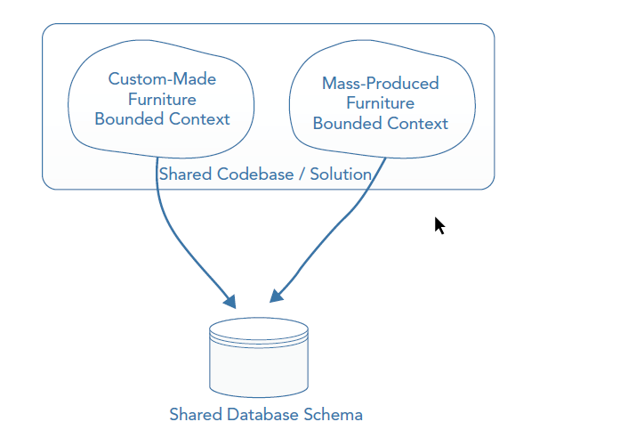
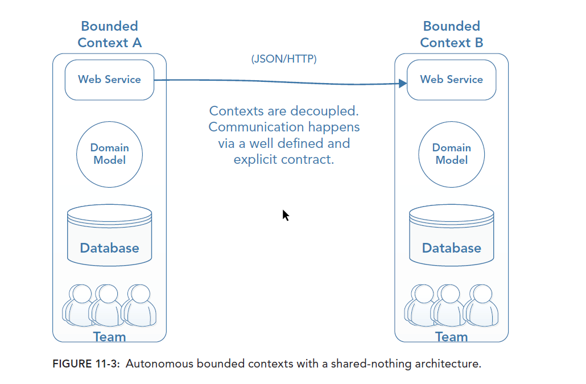
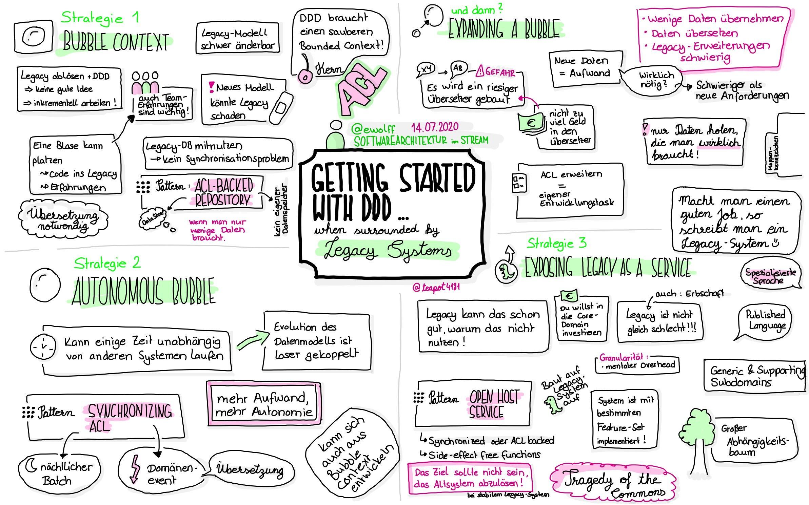
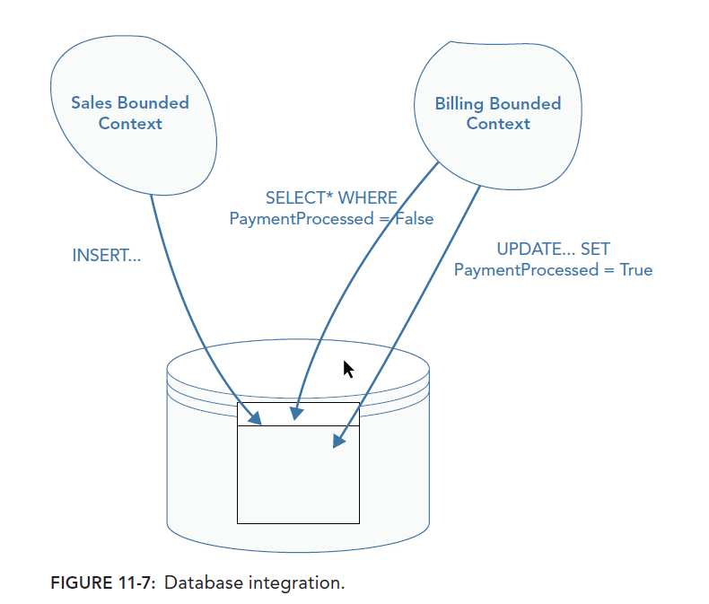
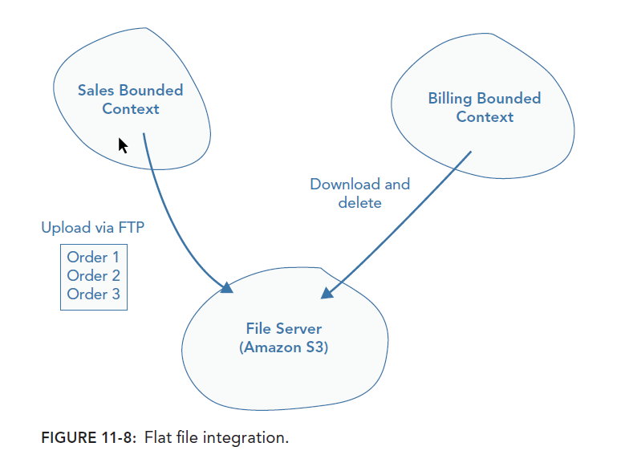

# Chapter 11 - Introduction to Bounded Context Integration

## Salient Points
- These days, the majority of applications you are likely to build are distributed systems
  because large web traffic arises from everyone having access to the Internet, and from many
  devices.
- Applying DDD to distributed systems still provides lots of benefits, but there are new
  challenges when integrating bounded contexts.
- Some of the challenges are technical, such as scalability and reliability, whereas others are
  social, such as integrating teams and developing at a high velocity.
- A number of techniques exist for building distributed systems that trade off simplicity,
  maintainability, and scalability. Database integration, for instance, can be quick to set up,
  but isn’t recommended for use in high‐scalability environments.
- RPC and messaging are the most common forms of distributed systems integration and the
  ones you are most likely to use. They are significantly different in nature, so it’s essential you
  understand what benefits and complications they will add to your system.
- You can use the loosely coupled, business‐oriented philosophy of SOA to help design your
  bounded context integration strategy by thinking of bounded contexts as SOA services.
- Combining SOA and reactive programming provides the platform to align your infrastructure
  with business priorities, deal with scalability and reliability challenges, and organize your
  teams by aligning them with bounded contexts to reduce communication overhead.

## Possible solutions

- Namespace
- Integrate via Database
- Flat File integration
- RPC
- Messaging
- Rest

# The Challenges of Integrating Bounded Contexts at the Code Level
  
## Namespace

One single solution for all bounded contexts. The separation of bcs is done by separated namespaces. Risk is to break other contexts when changing data. Teams have shared code and needs a lot of communication, this slows development down.

## Integrating via Database 

If two teams share the same database you will get a problem when you want to upgrade the corresponding schema. This slows down development output.
Another problem is that the database creates generic constructs to fullfill every consumer. It could also possible that there are database columns which are only used by one context not by another.

## Multiple Teams working in a single codebase

Problemtic when two teams work on same codebase. This increases the WIP of a codebase and that produces problems for releases. If you are using feature branches you will get long-running feature branches.

## Models blur
On large codebases with multiple bounded contexts it is inevitable that boundaries of each model will not remain intact. It leads to tight dependencies. 

**You might have code in two bounded contexts that look very similar, and
  you may feel you are violating the Don’t Repeat Yourself (DRY) principle, but a lot of the time that
  is not a problem. Very often you will find that even though the code looks the same to begin with, it changes in each bounded context for different reasons as new concepts and insights emerge. By not coupling the bounded concepts, there is no friction when you try to incorporate the new concepts and insights. Duplication is a problem because you may update code in one place, and forget to update it in another. However, this is rarely a problem when you have loosely coupled, bounded contexts that are intended to run in isolation.**
  
## Use physical boundaries to enforce clean models

Most widely used approach is shared-nothing architecture. Since there is a distinct physical separation, they have to go out of their way to introduce coupling.

# Integrating with Legacy Systems

Refer to eric evans paper [Getting Started with DDD When Surrounded By Legacy Systems](http://domainlanguage.com/ddd/strategy/GettingStartedWithDDDWhenSurroundedByLegacySystemsV1.pdf). Another great source which discusses this article is [Eberhard Wolff Software-Architektur.tv](https://software-architektur.tv/folge6.html)

tbd.

# Integration Strategies for distributed bounded contexts

Distributed systems bring nonfunctional requirements to the table: scalability, availability,
reliability. Scalability is the ability to be able to support increasing loads, such as more concurrent
users. Availability is concerned with how often the application is online, running, and supporting
its users. Another consideration is reliability, which is concerned with how well a system copes with
errors.

## db integration

An accessible approach to integrating bounded contexts is letting one application write to a specific
database location that another application reads from. It’s likely that you would want to employ this
approach in first‐iteration Minimum Viable Products (MVPs) or nonperformance critical parts of
the system.

## Flat file integration
If you aren’t using a database in your project, setting one up just to integrate two components
can be unnecessary overhead. This is one example in which flat file integration may be good
enough. Flat file integration is a more flexible approach than database integration, but you have to be more creative, which can in turn mean more effort and slower lead times on important business functionality.

## RPC

Imagine if you could keep your monolithic almost identical but get the scalability benefits of a
distributed system. This is the motivating force behind the use of RPC. If you were to talk to enough companies using RPC, you would find examples using most kinds of web service—Simple Object Access Protocol (SOAP),REpresentational State Transfer (REST), eXtensible Markup Language (XML)—using a variety of different technologies, such as Windows Communication Foundation (WCF).

### Problem with rpc
- RPC Is Harder to Make Resilient
- RPC Costs More to Scale
- RPC Involves Tight Coupling -> Logical Coupling - Temporal Coupling

## Messaging

Quite simply, networks are unreliable. Reactive solutions try to embrace failure by increasing reliability using asynchronous messaging patterns for communication. The entire design and architecture of messaging systems are significantly different and teams are challenged with an intimidating learning curve.

## REST
If you want the scalability and reliability benefits of messaging solutions, but you want to use Hypertext Transport Protocol (HTTP) instead of messaging frameworks, try REST. You can then build event‐driven systems on top of HTTP with REST to get many of the benefits of a messaging system, and sometimes fewer of the problems.

